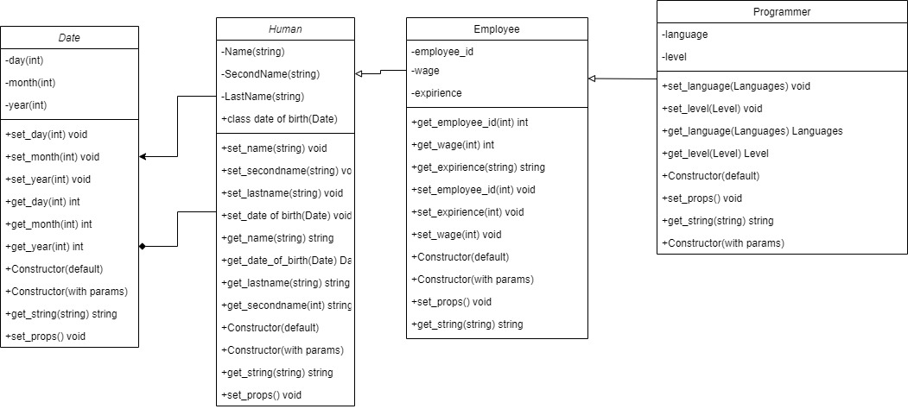

# Наследование

Автор: Гурбатов Владислав ИВТ-20

## Класс Человек

### Поля

* Имя
* Фамилия
* Отчество
* Дата рождения

### Методы

* Сеттеры, геттеры
* Конструктор по умолчанию
* Конструктор с параметрами
* Вывод всей информации в виде строки

## Класс рабочий

### Поля

* Паспортные данные
* Зараплата

### Методы

* Сеттеры, геттеры
* Конструктор по умолчанию
* Конструктор с параметрами
* Вывод всей информации в виде строки

## Класс программист

### Поля

* Уровень
* Стаж работы
* Язык программирования

### Методы

* Сеттеры, геттеры
* Конструктор по умолчанию
* Конструктор с параметрами
* Вывод всей информации в виде строки

## Класс дата

### Поля

* День
* Месяц
* Год

### Методы

* Сеттеры, геттеры
* Конструктор по умолчанию
* Конструктор с параметрами
* Вывод всей информации в виде строки

## UML Diagram

